# Architecture

## System Overview

GraphProbe AI is a multi-pipeline investigation platform that compares RAG, GraphRAG, and Agentic GraphRAG on the same questions and evidence corpus.

## Architecture Diagram

```mermaid
graph TB
    User[User] --> Frontend[Frontend React/TypeScript]
    Frontend --> API[FastAPI Backend]
    
    API --> Orchestrator[Orchestrator]
    
    Orchestrator --> RAG[RAG Pipeline]
    Orchestrator --> GraphRAG[GraphRAG Pipeline]
    Orchestrator --> Agentic[Agentic GraphRAG Pipeline]
    
    RAG --> Vector[Vector Retrieval]
    GraphRAG --> GraphService[TigerGraph Service]
    GraphRAG --> Vector
    Agentic --> AgentOrchestrator[Agent Orchestrator]
    
    AgentOrchestrator --> EntityLink[Entity Linking]
    AgentOrchestrator --> GraphService
    AgentOrchestrator --> Vector
    AgentOrchestrator --> EvidenceEval[Evidence Evaluation]
    
    GraphService --> TigerGraph[TigerGraph]
    Vector --> ChromaDB[ChromaDB]
    
    RAG --> LLM[LLM Service]
    GraphRAG --> LLM
    Agentic --> LLM
    
    API --> Benchmark[Benchmark Runner]
    Benchmark --> Orchestrator
    
    API --> Evaluation[Evaluation Pipeline]
    Evaluation --> Metrics[Metrics Calculation]
    
    Frontend --> MetricsDashboard[Metrics Dashboard]
    Metrics --> MetricsDashboard
    
    subgraph Storage
        TigerGraph
        ChromaDB
        Results[(Benchmark Results)]
        Traces[(Agent Traces)]
    end
    
    style Frontend fill:#64ffda
    style API fill:#00b4d8
    style Orchestrator fill:#233554
    style TigerGraph fill:#ff6b6b
    style ChromaDB fill:#ffd93d
```



## Components

### Frontend
- **Framework**: React with TypeScript
- **Styling**: Tailwind CSS with custom dark theme
- **Pages**: Overview, Investigate, Compare, Metrics, Agent Trace, Evidence Graph
- **Charts**: Recharts for metrics visualization

### Backend
- **Framework**: FastAPI with Python
- **API Endpoints**: Investigate, Compare, Benchmark, Health, Trace, Evidence, Metrics
- **Services**: Orchestrator, LLM Service, TigerGraph Service, Vector Retriever

### Pipelines

#### RAG Pipeline
1. Query embedding
2. Vector similarity search (ChromaDB)
3. Top-k document chunks retrieval
4. LLM answer generation
5. Citation extraction

#### GraphRAG Pipeline
1. Entity extraction and linking
2. TigerGraph graph lookup
3. Multi-hop graph traversal
4. Related entities and documents
5. LLM answer generation with graph context
6. Citation extraction

#### Agentic GraphRAG Pipeline
1. Stateful orchestrator with agent state
2. Dynamic tool selection based on evidence
3. Tools: Entity Link, Graph Traverse, Vector Search, Document Retrieve, Evidence Evaluate
4. Stopping criteria: evidence sufficiency, max iterations, token budget
5. Complete agent trace with step-by-step reasoning

### Storage

#### TigerGraph
- Graph entities and relationships
- Multi-hop traversal support
- Graph vector capabilities

#### ChromaDB
- Document chunks with embeddings
- Vector similarity search
- Metadata filtering

#### File Storage
- Benchmark results (JSON/JSONL)
- Agent traces
- Evaluation reports

## Data Flow

### Investigation Flow
```
User Question → Frontend → API → Orchestrator → Pipeline Selection
→ Retrieval (Vector/Graph) → Evidence Collection → LLM Generation
→ Answer + Citations + Metrics → API → Frontend → Display
```

### Benchmark Flow
```
Evaluation Questions → Benchmark Runner → Orchestrator
→ All Pipelines → Results Storage → Evaluation → Metrics
→ Dashboard Visualization
```

### Agentic Flow
```
Question → Agent State → Decision Policy → Tool Selection
→ Action Execution → State Update → Evidence Evaluation
→ Stopping Check → (Continue/Stop) → Final Answer + Trace
```

## Key Design Decisions

### Why Three Pipelines?
- **RAG**: Baseline for simple retrieval
- **GraphRAG**: Demonstrates value of structural relationships
- **Agentic**: Shows when adaptive investigation justifies additional cost

### Why Stateful Agent?
- Enables dynamic tool selection based on evidence
- Supports adaptive investigation depth
- Provides complete explainability through traces

### Why TigerGraph?
- Native graph database with vector capabilities
- Official hackathon requirement
- Supports multi-hop traversal at scale

### Why Separate Evaluation?
- Ensures fair comparison across pipelines
- Provides reproducible benchmarking
- Enables classification of question types

## Scalability Considerations

- Async/await throughout for concurrent operations
- Resumable benchmark execution
- Configurable limits (iterations, tokens, hops)
- Efficient vector indexing with ChromaDB
- TigerGraph query optimization

## Security

- Environment variables for all secrets
- No hardcoded credentials
- Input validation with Pydantic
- CORS configuration
- Error handling without information leakage
